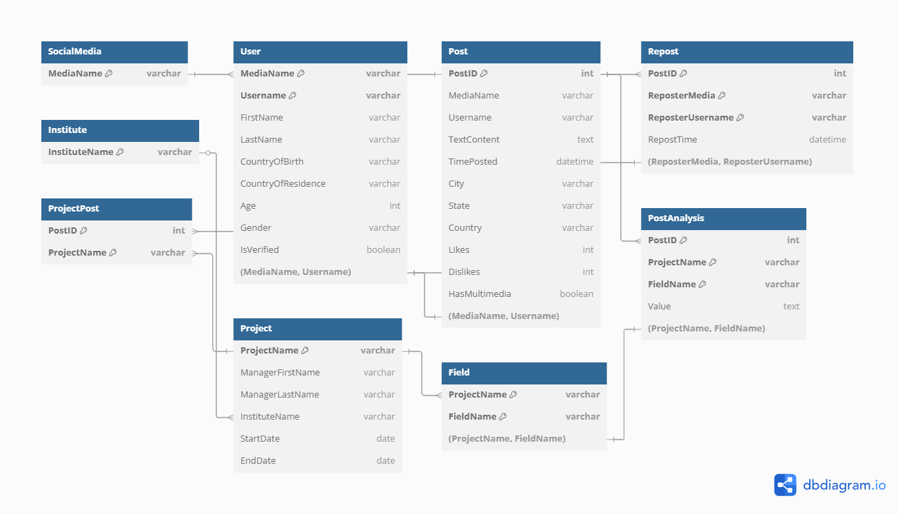

```{r setup, include=FALSE}
knitr::opts_chunk$set(echo = TRUE)
```

# Introduction

This document presents the database design for the Social Media Analysis System project. It includes the schema and ER diagram for storing social media posts, user metadata, repost information, and results of analysis projects.

\newpage

# ER Diagram

The following diagram illustrates the relationships between entities:



\newpage

# SQL Schema

```{sql, eval=FALSE}
-- Social Media Platforms
CREATE TABLE SocialMedia (
    MediaName VARCHAR(50) PRIMARY KEY
);

-- Users
CREATE TABLE User (
    MediaName VARCHAR(50),
    Username VARCHAR(40),
    FirstName VARCHAR(50),
    LastName VARCHAR(50),
    CountryOfBirth VARCHAR(50),
    CountryOfResidence VARCHAR(50),
    Age INT,
    Gender ENUM('Male', 'Female', 'Other'),
    IsVerified BOOLEAN,
    PRIMARY KEY (MediaName, Username),
    FOREIGN KEY (MediaName) REFERENCES SocialMedia(MediaName)
);

-- Posts
CREATE TABLE Post (
    PostID INT AUTO_INCREMENT PRIMARY KEY,
    MediaName VARCHAR(50),
    Username VARCHAR(40),
    TextContent TEXT NOT NULL,
    TimePosted DATETIME,
    City VARCHAR(50),
    State VARCHAR(50),
    Country VARCHAR(50),
    Likes INT DEFAULT 0,
    Dislikes INT DEFAULT 0,
    HasMultimedia BOOLEAN,
    FOREIGN KEY (MediaName, Username) REFERENCES User(MediaName, Username)
);

-- Reposts
CREATE TABLE Repost (
    PostID INT,
    ReposterMedia VARCHAR(50),
    ReposterUsername VARCHAR(40),
    RepostTime DATETIME,
    PRIMARY KEY (PostID, ReposterMedia, ReposterUsername),
    FOREIGN KEY (PostID) REFERENCES Post(PostID),
    FOREIGN KEY (ReposterMedia, ReposterUsername) REFERENCES User(MediaName, Username)
);

-- Institutes
CREATE TABLE Institute (
    InstituteName VARCHAR(100) PRIMARY KEY
);

-- Projects
CREATE TABLE Project (
    ProjectName VARCHAR(100) PRIMARY KEY,
    ManagerFirstName VARCHAR(50),
    ManagerLastName VARCHAR(50),
    InstituteName VARCHAR(100),
    StartDate DATE,
    EndDate DATE,
    FOREIGN KEY (InstituteName) REFERENCES Institute(InstituteName),
    CHECK (EndDate >= StartDate)
);

-- Fields per Project
CREATE TABLE Field (
    ProjectName VARCHAR(100),
    FieldName VARCHAR(50),
    PRIMARY KEY (ProjectName, FieldName),
    FOREIGN KEY (ProjectName) REFERENCES Project(ProjectName)
);

-- Posts associated with Projects
CREATE TABLE ProjectPost (
    ProjectName VARCHAR(100),
    PostID INT,
    PRIMARY KEY (ProjectName, PostID),
    FOREIGN KEY (ProjectName) REFERENCES Project(ProjectName),
    FOREIGN KEY (PostID) REFERENCES Post(PostID)
);

-- Results per Post-Project-Field
CREATE TABLE PostAnalysis (
    PostID INT,
    ProjectName VARCHAR(100),
    FieldName VARCHAR(50),
    Value TEXT,
    PRIMARY KEY (PostID, ProjectName, FieldName),
    FOREIGN KEY (PostID) REFERENCES Post(PostID),
    FOREIGN KEY (ProjectName, FieldName) REFERENCES Field(ProjectName, FieldName)
);
```

\newpage

# Notes
- Users are uniquely identified per social media.
- A post can be reposted by others with timestamp tracking.
- Posts must be explicitly associated with projects using the `ProjectPost` table.
- Projects assign fields, and analysis values are stored per post and field.
- Queries will allow retrieval by username, media, date, and field analysis summary.

---

\newpage

# Appendix

DBML script to produce ER Diagram  

```{DBML, eval=FALSE}
Table SocialMedia {
  MediaName varchar [pk]
}

Table User {
  MediaName varchar
  Username varchar
  FirstName varchar
  LastName varchar
  CountryOfBirth varchar
  CountryOfResidence varchar
  Age int
  Gender varchar
  IsVerified boolean
  Note: "Composite primary key (MediaName, Username)"
  Indexes {
    (MediaName, Username) [pk]
  }
}

Table Post {
  PostID int [pk, increment]
  MediaName varchar
  Username varchar
  TextContent text
  TimePosted datetime
  City varchar
  State varchar
  Country varchar
  Likes int
  Dislikes int
  HasMultimedia boolean
}

Table Repost {
  PostID int
  ReposterMedia varchar
  ReposterUsername varchar
  RepostTime datetime
  Note: "Composite primary key (PostID, ReposterMedia, ReposterUsername)"
  Indexes {
    (PostID, ReposterMedia, ReposterUsername) [pk]
  }
}

Table Institute {
  InstituteName varchar [pk]
}

Table Project {
  ProjectName varchar [pk]
  ManagerFirstName varchar
  ManagerLastName varchar
  InstituteName varchar
  StartDate date
  EndDate date
}

Table Field {
  ProjectName varchar
  FieldName varchar
  Note: "Composite primary key (ProjectName, FieldName)"
  Indexes {
    (ProjectName, FieldName) [pk]
  }
}

Table PostAnalysis {
  PostID int
  ProjectName varchar
  FieldName varchar
  Value text
  Note: "Composite primary key (PostID, ProjectName, FieldName)"
  Indexes {
    (PostID, ProjectName, FieldName) [pk]
  }
}

Table ProjectPost {
  PostID int
  ProjectName varchar

  Note: "Links posts to projects even if no analysis results exist"
  Indexes {
    (PostID, ProjectName) [pk]
  }
}

Ref: ProjectPost.PostID > Post.PostID
Ref: ProjectPost.ProjectName > Project.ProjectName
Ref: User.MediaName > SocialMedia.MediaName
Ref: Post.(MediaName, Username) - User.(MediaName, Username)
Ref: Repost.PostID > Post.PostID
Ref: Repost.(ReposterMedia, ReposterUsername) - User.(MediaName, Username)
Ref: Project.InstituteName > Institute.InstituteName
Ref: Field.ProjectName > Project.ProjectName
Ref: PostAnalysis.PostID > Post.PostID
Ref: PostAnalysis.(ProjectName, FieldName) - Field.(ProjectName, FieldName)
```